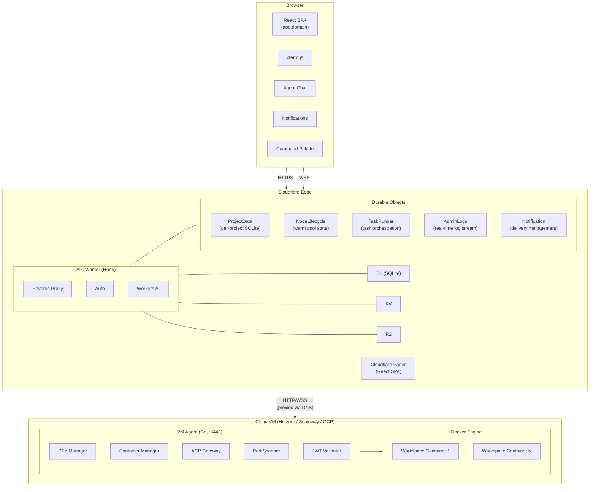
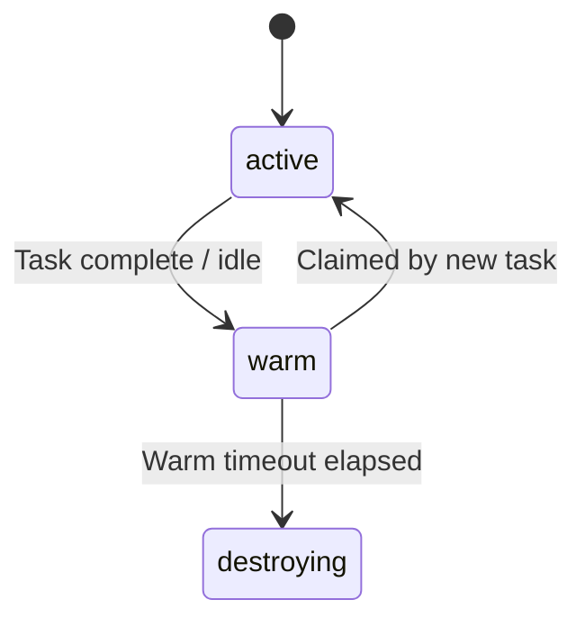
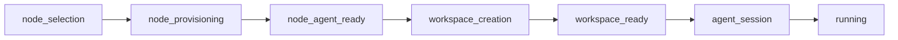
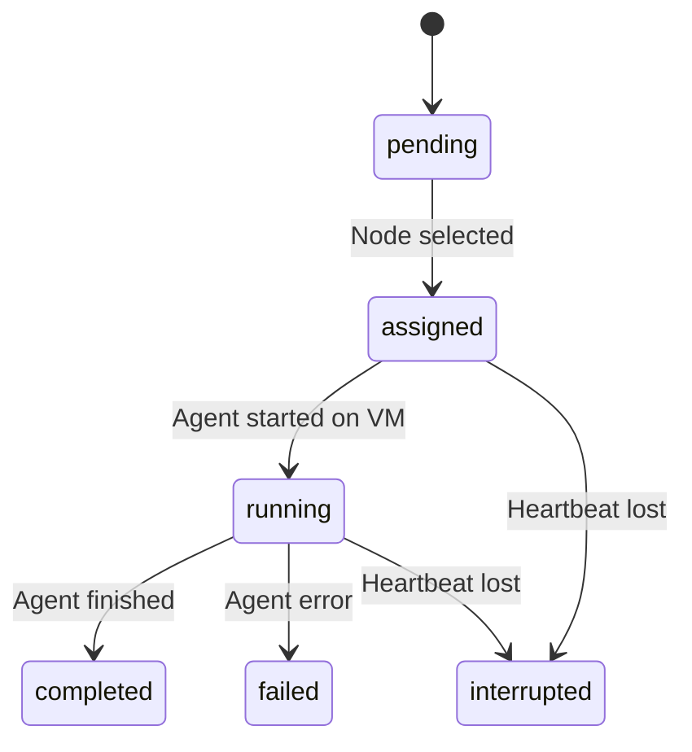
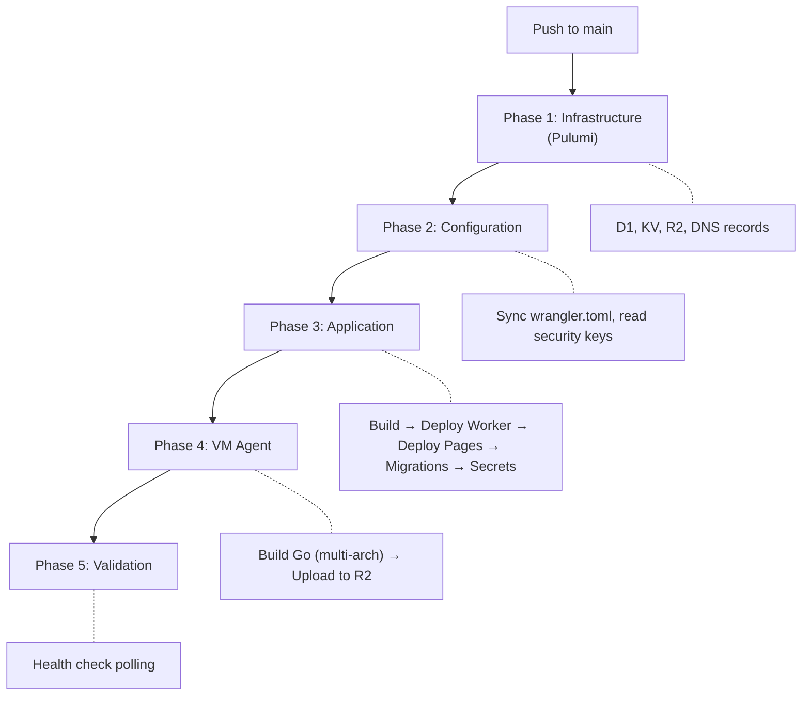

SAM is a serverless platform for ephemeral AI coding environments. The architecture splits into three layers: **edge** (Cloudflare), **compute** (cloud VMs — Hetzner, Scaleway, or GCP), and **external services** (GitHub, DNS).

## High-Level Architecture

## Request Routing

Every request to `*.domain` passes through the same Cloudflare Worker. The `Host` header determines routing:

| Pattern | Destination | How |
|---------|-------------|-----|
| `app.{domain}` | Cloudflare Pages | Worker proxies to `{project}.pages.dev` |
| `api.{domain}` | Worker API routes | Direct handling by Hono router |
| `ws-{id}.{domain}` | VM Agent on port 8443 | Worker proxies via `{nodeId}.vm.{domain}` backend hostname |
| `ws-{id}--{port}.{domain}` | Workspace port proxy | Worker proxies to dev server running on `{port}` |
| `r{N}-{service}-{port}-{env}.apps.{domain}` | Deployment public route | DNS-only A record points at the deployment node; node-local Caddy terminates TLS |
| `*.{domain}` (other) | 404 | No matching route |

:::note[Why backend hostnames?]
Cloudflare Workers can't fetch IP addresses directly (Error 1003). Node backend DNS records (`{nodeId}.vm.{domain}` → VM IP) are created so the Worker can proxy through hostnames, with `*.vm.{domain}` excluded from the Worker route.
:::

Deployment public routes do not pass through the Worker proxy. The API derives a
stable hostname and loopback host port for each public route in a release,
creates the SAM-owned DNS-only A record, and sends those route targets inside
the signed deployment apply payload. The deployment node's Caddy instance then
terminates TLS and reverse-proxies to `127.0.0.1:{hostPort}`. User-owned custom
subdomains reuse the same signed route-target path after DNS verification, but
SAM does not create those user DNS records.

## Control Plane — API Worker

The API Worker (`apps/api/`) is a Hono application handling:

- **Authentication** — GitHub OAuth via BetterAuth
- **Resource management** — CRUD for nodes, workspaces, projects, ideas
- **Reverse proxy** — workspace subdomain, port traffic, and file proxy to VMs
- **Durable Objects** — per-project data, node lifecycle, idea orchestration, notifications
- **Workers AI** — idea title generation, voice transcription, text-to-speech, context summarization
- **MCP server** — project-aware tools for running agents
- **Cron triggers** — provisioning timeout checks, warm node cleanup, orphan detection

### Key Route Groups

| Route | Purpose |
|-------|---------|
| `/api/auth/*` | GitHub OAuth sign-in/out, sessions |
| `/api/nodes/*` | Node CRUD, lifecycle, health callbacks |
| `/api/workspaces/*` | Workspace CRUD, lifecycle, boot logs, agent sessions |
| `/api/projects/*` | Project CRUD, runtime config, ideas, chat sessions, file proxy |
| `/api/credentials/*` | Cloud provider + agent API key management |
| `/api/notifications/*` | Notification list, read/dismiss, preferences, WebSocket |
| `/api/tasks/*` | Idea submission, lifecycle, status updates |
| `/api/github/*` | GitHub App installations, repos |
| `/api/terminal/token` | Workspace JWT for WebSocket auth |
| `/api/agent/*` | VM Agent binary download |
| `/api/bootstrap/:token` | One-time credential injection |
| `/api/admin/*` | Admin dashboard, error logs, real-time log stream |
| `/api/tts/*` | Text-to-speech synthesis |
| `/api/transcribe` | Voice-to-text transcription |

## Data Layer — Hybrid D1 + Durable Objects

SAM uses a hybrid storage model: **D1** for cross-project queries and **Durable Objects** for write-heavy, project-scoped data.

### D1 (Cross-Project Queries)

| Binding | Purpose |
|---------|---------|
| `DATABASE` | Users, projects, nodes, workspaces, ideas, credentials |
| `OBSERVABILITY_DATABASE` | Error storage for admin dashboard |

D1 stores platform-level data that needs to be queried across projects (e.g., "show all my ideas" on the dashboard).

### Durable Objects (Per-Project Data)

| Binding | Scope | Storage | Purpose |
|---------|-------|---------|---------|
| `PROJECT_DATA` | Per project | SQLite | Chat sessions, messages, activity events, ACP sessions |
| `NODE_LIFECYCLE` | Per node | KV | Warm pool state machine (active → warm → destroying) |
| `TASK_RUNNER` | Per idea | KV | Multi-step idea execution orchestration via alarm callbacks |
| `ADMIN_LOGS` | Singleton | KV | Real-time log broadcast to admin WebSocket clients |
| `NOTIFICATION` | Per user | KV | Notification delivery and state management |

### Why Hybrid?

D1 handles reads well but has write contention under high concurrency. Chat messages and activity events generate high-frequency writes that would overwhelm D1. Durable Objects provide single-threaded SQLite access per project, eliminating contention while keeping data co-located.

Summary data flows back from DOs to D1 via debounced sync (e.g., `last_activity_at`, `active_session_count` on the projects table).

### Other Bindings

| Service | Binding | Purpose |
|---------|---------|---------|
| **KV** | `KV` | Auth sessions, bootstrap tokens, boot logs, MCP tokens |
| **R2** | `R2` | VM Agent binaries, TTS audio cache, Pulumi state |
| **Workers AI** | `AI` | Idea title generation, transcription, TTS, context summarization |

## Durable Objects Deep Dive

### ProjectData DO

Each project gets one `ProjectData` Durable Object instance, accessed via `env.PROJECT_DATA.idFromName(projectId)`.

**Embedded SQLite tables:**
- `chat_sessions` — session metadata, lifecycle status, message counts
- `chat_messages` — append-only streaming token log; each row is one streaming chunk from Claude Code, not a logical message. Consecutive same-role tokens (assistant, tool, thinking) are grouped into logical messages at the API and UI layers.
- `chat_messages_grouped` — materialized grouped messages, populated when a session stops by concatenating consecutive same-role tokens. Source for FTS5 full-text search.
- `chat_messages_grouped_fts` — FTS5 virtual table indexed on grouped message content for full-text search with stemming and phrase matching.
- `activity_events` — audit trail (workspace created, session stopped, etc.)
- `chat_session_ideas` — many-to-many links between sessions and ideas
- `task_status_events` — idea lifecycle transitions with actor tracking
- `acp_sessions` — ACP session state machine with fork lineage
- `acp_session_events` — ACP session state transition history

**Key features:**
- Hibernatable WebSockets for zero-idle-cost real-time chat
- Heartbeat-based VM failure detection via DO alarms
- Session forking with parent lineage tracking
- Debounced D1 summary sync for dashboard data

### NodeLifecycle DO

Each node gets one `NodeLifecycle` Durable Object, accessed via `env.NODE_LIFECYCLE.idFromName(nodeId)`.

**State machine:**

- `markIdle(nodeId, userId)` — transitions to warm, schedules cleanup alarm
- `tryClaim(taskId)` — atomically claims a warm node for reuse (single-threaded, no races)
- `alarm()` — fires after warm timeout, triggers node destruction

### TaskRunner DO

Each idea execution gets one `TaskRunner` Durable Object, accessed via `env.TASK_RUNNER.idFromName(taskId)`.

**Orchestration steps** (each idempotent, alarm-driven):

Cross-DO coordination with NodeLifecycle (for warm node claims) and ProjectData (for session linkage). Exponential backoff on transient errors.

## ACP Session Lifecycle

Agent sessions are managed by the ProjectData DO with this state machine:

**Heartbeat detection**: VM agent sends heartbeats every 60 seconds. If no heartbeat within 5 minutes (`ACP_SESSION_DETECTION_WINDOW_MS`), the DO alarm marks the session as `interrupted`.

**Session forking**: Sessions track `parentSessionId` and `forkDepth` for lineage. Fork depth is limited to 10 (`ACP_SESSION_MAX_FORK_DEPTH`).

## VM Agent

The VM Agent (`packages/vm-agent/`) is a Go binary running on each node:

| Subsystem | Package | Responsibility |
|-----------|---------|---------------|
| PTY Manager | `internal/pty/` | Terminal multiplexing, ring buffer replay |
| Container Manager | `internal/container/` | Docker exec, devcontainer CLI |
| ACP Gateway | `internal/acp/` | Agent protocol, streaming responses, notification serialization |
| Port Scanner | `internal/ports/` | Auto-detect listening ports, build proxy URLs |
| JWT Validator | `internal/auth/` | Validates workspace JWTs via JWKS endpoint |
| Persistence | `internal/persistence/` | SQLite tab/session storage |
| Boot Logger | `internal/bootlog/` | Reports provisioning progress |
| Message Reporter | `internal/messagereport/` | Outbox-based message relay to control plane |

## Deployment Pipeline

CI runs lint, typecheck, tests, and build on every push. The deploy workflow only triggers on pushes to `main`.

## Key Design Decisions

| Decision | Rationale |
|----------|-----------|
| Single Worker as API + reverse proxy | Simplifies infrastructure — one Worker handles everything |
| Hybrid D1 + Durable Objects | D1 for cross-project reads, DOs for high-throughput project-scoped writes |
| User-provided cloud tokens (BYOC) | Users own their infrastructure and costs |
| Callback-driven provisioning | VMs POST `/ready` when bootstrapped — no polling |
| Dynamic DNS per workspace | Instant subdomain resolution; cleaned up on stop |
| Alarm-driven execution orchestration | Idempotent steps with exponential backoff; no long-running processes |
| No credentials in cloud-init | Bootstrap tokens for secure credential injection |
| Multi-provider abstraction | Unified VM size/lifecycle API across Hetzner, Scaleway, and GCP |
