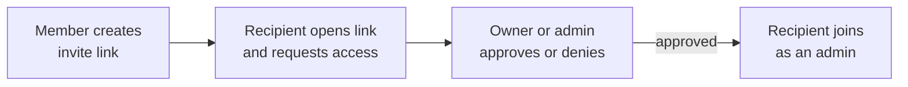

A SAM project can be shared with a small team. Members work in the same project — they see each other's chat sessions, reuse the same agent profiles and skills, and run against the same repository — while every member's personal API keys and cloud credentials stay their own.

This guide covers the whole collaboration loop: inviting people, approving access, what teammates can and cannot use, and how to keep track of whose keys are paying for shared work.

> Collaboration is designed for small, trusted teams (roughly 3–10 people). Both **owners** and **admins** can approve new members, so approval does not bottleneck on a single person.

## How access works

SAM does not send email invitations. Instead, access is a three-step flow:

1. **Any active member** creates an invite link from the project's settings.
2. The recipient opens the link and **requests access** — the link never grants access on its own.
3. An **owner or admin** approves (or denies) the pending request. Approval adds the person to the project as an admin (see [Roles](#roles)).

Because the link only produces a _request_, sharing a link is safe: nobody joins your project until someone with permission approves them.

## Roles

Two roles are in use today: **owner** and **admin**. (Throughout this guide, _member_ just means anyone in the project — the only roles are owner and admin.) Roles control who can manage the project and its members — they do not change whose credentials pay for work (see [Credential attribution](#who-pays-credential-attribution)).

| Capability                                         | Owner | Admin |
| -------------------------------------------------- | ----- | ----- |
| Everyday work — chat, tasks, triggers, deployments | Yes   | Yes   |
| Create and revoke invite links                     | Yes   | Yes   |
| Approve or deny access requests                    | Yes   | Yes   |
| Remove other members (anyone except the owner)     | Yes   | Yes   |
| Manage connections, secrets, and infrastructure    | Yes   | Yes   |
| Transfer ownership                                 | Yes   | No    |
| Delete the project                                 | Yes   | No    |

- There is exactly one **owner** per project — the person who created it. The owner can transfer ownership to another member (who becomes the new owner); the previous owner stays on as an admin.
- **Everyone you approve through an invite joins as an admin.** Admins can do almost everything an owner can — approve and remove other members, create and revoke invite links, and manage connections, secrets, and infrastructure. They only lack transferring ownership and deleting the project.

Because approval grants admin access, **only invite people you trust with full control of the project.** Collaboration is built for small, trusted teams; finer-grained roles (read-only or limited members) are planned but not available yet.

## Invite a teammate

1. Open the project and go to **Settings → Access**.
2. In the **Members** panel, find **Invite Link** and click **Create Link** (the button reads **New Link** if a link already exists).
3. Click **Copy** and send the link to your teammate through any channel (chat, email, ticket).
4. Sending the link does not add anyone. Your teammate opens it and **requests access**, then you approve them under **Pending Requests** (see [Approve or deny requests](#approve-or-deny-requests)). They join the project — as an admin (see [Roles](#roles)) — and appear in the **Members** list only after you approve.

One link works for your whole team: share the same link with several people, and each opens it and requests access separately. You do not need a new link per teammate.

The panel shows and manages your most recently created invite link. From here you can:

- **New Link** — create a fresh link. This does **not** revoke the previous link: the old URL keeps working until it **expires** (see below) and, once replaced, is no longer shown in the panel — so you can no longer revoke it there. If you want the old URL dead immediately, click **Revoke** _before_ creating a new one.
- **Revoke** — immediately disable the shown link. Anyone who already joined keeps their access; only the link stops working.

Because a replaced link stays live until it expires, treat **Revoke-then-New-Link** as the safe way to rotate — especially since everyone who joins becomes an admin.

Invite links carry an **expiry** (shown as "Expires …") and a **use count** so you can see how much a link has been shared. Expiry length is configurable by self-hosters via `PROJECT_INVITE_DEFAULT_EXPIRY_DAYS` and `PROJECT_INVITE_MAX_EXPIRY_DAYS`.

The **Members** panel is the single place owners and admins manage everything: the invite link, current members and their roles, and any pending access requests.

## Request access (the recipient's view)

When someone opens an invite link, they land on a page that shows the project name and repository and a single **Request Access** button.

- Clicking **Request Access** creates a pending request and shows "Your request will be reviewed by a project owner or admin."
- If the repository is on GitHub, SAM checks whether your GitHub sign-in already has access to that repository and shows the result on the request (for example "GitHub sign-in needed" or "no repo access") so approvers can decide. If you see "GitHub sign-in needed," connect GitHub in your SAM settings so SAM can confirm your repository access.

**You must be signed in to SAM to request access.** If you do not have a SAM account yet, create one first (SAM uses GitHub or Google sign-in), then re-open the invite link to return to the Request Access page.

**How you'll know you're approved.** SAM does not email you when a request is approved. To check, re-open the same invite link — once an owner or admin approves you it shows **Open Project** — or open the project directly from your SAM dashboard, where approved projects appear in your project list.

## Approve or deny requests

Owners and admins manage requests from **Settings → Access → Members**:

- Pending requests appear under **Pending Requests** with the requester's name, email, and a GitHub-access badge.
- Click **Approve** to add the person to the project (as an admin), or **Deny** to reject the request.
- A denied person can **request access again** while the link is still active — denial is not a permanent block.

## What teammates share

Once someone is a member, the project becomes genuinely shared. Any active member can use the project's shared resources regardless of who created them:

- **Agent profiles** — the model, agent, and settings bundles configured for the project.
- **Skills** — reusable, repeatable-work configurations.
- **Project environment variables and secrets** — supplied to workspaces and tasks in the project.
- **Project files and runtime assets** — files SAM copies into each workspace.
- **Chat sessions** — everyone's sessions appear in the same list. A filter near the session search toggles between **my sessions** and **all sessions** so you can focus on your own work or watch everything happening in the project. See [Chat Features → Session filters](/docs/guides/chat-features/#session-filters-shared-projects).

What stays personal:

- **Your API keys and cloud credentials** are yours. A teammate never sees or uses your raw keys.
- **Nodes** (the VMs that host workspaces) are user-scoped resources, billed to the credential that provisioned them.

For repository work, SAM lets a member's workspace use the project's GitHub App installation to clone and push — but only after re-verifying that the running member still has access to that repository on GitHub. If a member loses GitHub repo access, their authenticated clone fails fast rather than silently falling back to an unauthenticated clone.

## Who pays: credential attribution

Sharing a project raises a practical question: **when a teammate's trigger or task runs, whose API key and cloud credential pays for it?**

By default, a resource runs on the **personal** keys of the member who set it up — a teammate's trigger bills the teammate's key, not yours. The catch is shared automation: if you create a trigger on your personal key, the whole team benefits from work that keeps charging you. To make this visible, a shared project shows a **Credentials** indicator in the project navigation.

- The indicator only appears once a project is actually shared (more than one member, an active invite link, or a pending request) and there are credential-backed resources. If you do not see it, the project either is not shared yet or has no credential-backed resources (triggers, running tasks, nodes, or deployments) to attribute — it appears as soon as one exists.
- It shows a small badge — for example how many resources still run on personal keys, or "No shared keys" when everything is covered.
- Clicking it opens the **Credential Attribution** panel, which lists credential-backed resources (triggers, running tasks, nodes, deployments, and project credential attachments) grouped by type. Each row names the resource and the member whose credential it uses, and shows whether it is covered by a **project credential** (green check) or a **personal** key (warning) — so you can tell your own resources from a teammate's.

You have two levers, depending on your goal:

- **Move the cost onto a shared key** — click **Fix** on a personal-key row to go to **Settings → Connections** and attach a project-scoped credential. Members' sessions then use the shared project credential instead of an individual's key. (If you attach your _own_ key as the project credential, you are still the one paying.)
- **Stop the work entirely** — disable or delete the trigger or task from the **Triggers** page (or the resource itself). Attaching a credential changes _who_ pays; it does not stop the automation.

The goal is not to block sharing — invites and approvals continue regardless. It is to give the team a clear view of which shared work runs on an individual's personal keys, so you can decide, deliberately, what to move onto a shared credential and what to leave as-is.

## Manage members

The **Members** panel under **Settings → Access** lists every member with their role and status. From here owners and admins can:

- **Transfer ownership** (owner only) — promote an admin to owner. The current owner becomes an admin and keeps admin controls; only ownership-specific actions move to the new owner. Personal credentials are never copied or moved.
- **Remove member** — remove another non-owner member from the project.
- **Leave project** — any non-owner member can remove themselves.

### Offboarding: what happens to a departing member's resources

Removing a member or leaving a project opens an **offboarding** step that previews the resources tied to that member — triggers they created, running tasks, attached credentials — and makes you choose what happens to each before finalizing. This exists precisely so a departure does not silently break shared automation.

The key thing to understand: **personal credentials leave with their owner.** A resource that was running on the departing member's personal key will stop working once they are gone unless you re-point it at a project credential. The preview lets you decide, per resource:

- **Keep it running on a shared key** — point the resource at an existing project credential (the **Use existing project credential** option) so it survives the departure. This is how you keep a nightly trigger or a deployment alive. You need a compatible project credential connected under **Settings → Connections**.
- **Disable it** — a trigger is disabled and flagged, and a task's future work is stopped and flagged, so nothing runs silently broken.
- **Defer** — postpone a resource instead of resolving it now. Deferring does not clear a block, so any resource that blocks removal (see below) still has to be disabled, reattached, or deleted before you can finish.

Some resources **block removal** until they are resolved, so you can't accidentally remove a member out from under running work, and each type clears the block differently: a **trigger** clears it when you disable it or reattach it to a project credential; a **task** clears it only by stopping its future work (tasks can't be reattached); a **node or deployment** clears it only by reattaching to a project credential. If no compatible project credential is available for a node or deployment, stop or delete it separately before finishing the removal.

Combined with the credential-attribution indicator above, this keeps a member's exit from unexpectedly cutting off the team's automation — you decide, up front, what survives.

## Related

- [Chat Features](/docs/guides/chat-features/) — session filters for shared projects, forking, and the command palette.
- [AI Agents](/docs/guides/agents/) — agent profiles and provider modes that members share.
- [Webhook Triggers](/docs/guides/webhook-triggers/) — automated work that runs on a project credential or a member's personal key.
