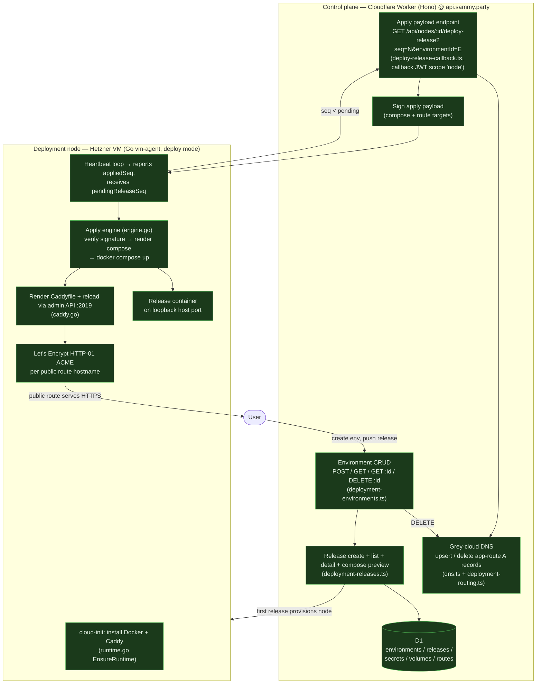
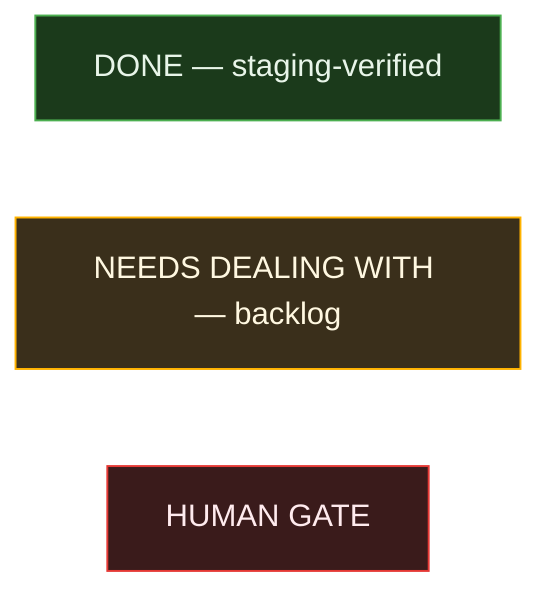
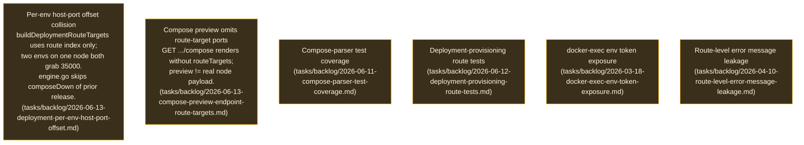

# App-Deployment System — Where We're At (post-#1308)

> Snapshot taken 2026-06-13 on branch `sam/resume-land-caddy-routingtls-01ktyg`.
> Captures the end-to-end user-app deployment pipeline after PR #1308
> ("Productionize Caddy routing + TLS for app-deployment nodes") merges.
> This is the **user-app deployment** feature, NOT the platform self-host deploy
> (spec `005-automated-deployment`).

## Pipeline overview

## Status legend

### DONE (verified on staging)
- Environment CRUD incl. ownership-checked `DELETE` with DNS + cascade cleanup.
- Release create/list/detail (single-service slice-2 constraint, secrets stored by name).
- First-release node provisioning; seq-based heartbeat apply loop.
- Signed apply payload (compose + route targets); signature verify on node.
- Grey-cloud app-route A record provision **and** teardown (idempotent, 404-tolerant).
- Caddy install via cloud-init; Caddyfile render + admin-API **reload** (not restart).
- Let's Encrypt HTTP-01 TLS per public route hostname.
- 3 staging-verified runtime fixes (caddy ownership normalize, restart-when-reload-down,
  startup preflight + ACME global options).

### NEEDS DEALING WITH (open follow-ups)

### HUMAN GATE
- PR #1308 carries the `needs-human-review` label by design (DO NOT MERGE until a
  human removes it). Preflight Evidence + SonarCloud now PASS; that label is the only
  remaining red check and it is the intentional merge gate.

## Notes
- App-route hostname scheme: `r{index+1}-{service}-{port}-{envIdLower}.apps.{baseDomain}`
  using the FULL 26-char ULID. Record IDs are not persisted — teardown reconstructs
  hostnames from each release manifest via `collectEnvironmentRouteHostnames`.
- The host-port collision (item A) is currently *masked* because `sam-internal` became a
  bridge network (commit 5b0765bd); it will resurface for multi-env-per-node.
