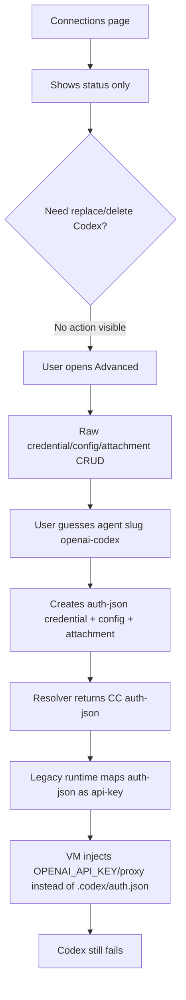
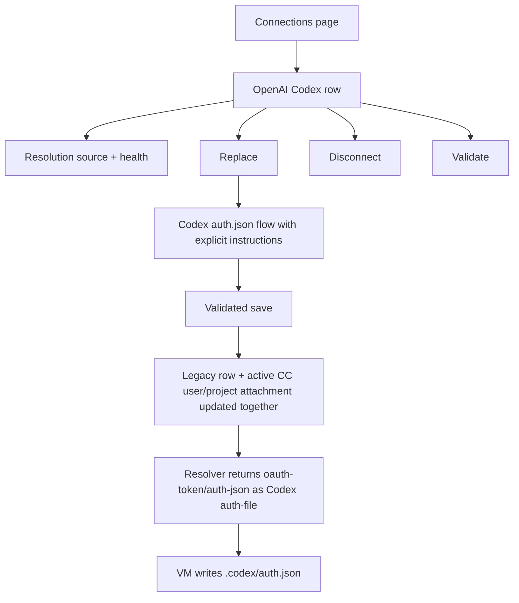
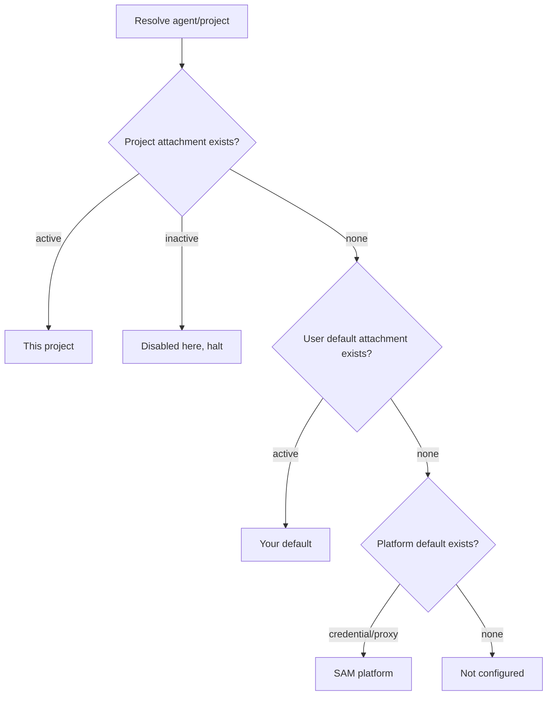

# Credential Management UX And Codex Fixes

## Problem

Raphaël reported the following exact symptoms from `https://app.sammy.party/settings/connections`:

- He was logged in as the primary user.
- He tried to delete/update an old Codex credential and add a new one.
- The Connections page did not make it clear how to delete or update Codex credentials.
- Advanced was used as a fallback. Clicking Delete on `openai-codex oauth-token (migrated)` resulted in an error.
- Workaround attempted: add a new credential, remove the old config and attachment, add a new config, and add a new attachment to make it the default.
- Advanced raw primitives forced guessing slugs; for Codex the correct slug seemed to be `openai-codex`.
- After manual credential/config/attachment creation, Codex still did not work, even though the saved `auth.json` was believed to be valid.

## Evidence

- SAM MCP history search completed for `composable credentials`, `Connections`, `credential UX`, `openai-codex`, `oauth-token`, `auth.json`, `delete credential`, `advanced credentials`, and `alternative inference providers`.
- PR audit:
  - #1315 introduced the CC three-primitive model.
  - #1316 fixed snapshot resilience.
  - #1317 fixed platform-default short-circuiting user backfill.
  - #1320 merged the first Connections tab and Advanced split.
  - #1322 is still an open draft backend integration branch touching credential/runtime/proxy paths; this branch remains based on `main`.
- `app.sammy.party` is staging per repo rules. Production was checked because the prompt called these production symptoms; staging holds the exact failed workaround state.
- Staging, non-secret D1 evidence: a new `updated-openai-codex` CC credential exists with `kind = auth-json`, a config targeting `agent/openai-codex`, and a user-default attachment.
- Staging VM-agent evidence after that change: Codex credential fetch returned `credentialKind = api-key` with passthrough proxy config, followed by prompt failures against `/ai/proxy/.../openai/v1` 404s.
- Code cause: `apps/api/src/routes/credentials.ts:mapResolvedToLegacy()` maps CC `auth-json` to legacy `api-key`, so VM agent treats Codex `auth.json` as `OPENAI_API_KEY` instead of auth-file injection.
- Code cause: #1320 ConnectFlow writes through legacy `PUT /api/credentials/agent`, but when CC rows already exist, `lazyBackfillIfNeeded()` no-ops and the resolver ignores later legacy writes.
- Code cause: migrated CC credential IDs include ciphertext-derived characters including `/`; Advanced client interpolates raw IDs into `/api/cc/credentials/${id}`, so delete/update can fail before the route receives the intended ID.

## Production-Readiness Follow-Up

2026-06-16 hardening pass:

- Resolved the `/settings/connections` unit test provider failure by rendering the route inside `ToastProvider`.
- Split `apps/web/src/pages/ProjectSettings.tsx` into focused project settings sections so the file-size gate passes.
- Split Advanced credential configuration UI into `ConfigurationSection` and added inline configuration update support; create/delete-only was not enough for expired-key replacement workflows.
- Added regression tests for configuration create/update/delete, project override removal without deleting user defaults, connection validation handling, and encoded IDs containing `/`, `+`, and `=`.
- Revalidated Sonar/code-quality risk by reducing duplicate settings UI and keeping credential/configuration behavior covered at the web client and API route layers.

## Before Journey



## Target Journey



## Data Model Flow

```mermaid
flowchart LR
  UI[Connections action] --> API[Credential connection API]
  API --> Legacy[credentials row]
  API --> Cred[cc_credentials]
  Cred --> Cfg[cc_configurations]
  Cfg --> Att[cc_attachments]
  Att --> Resolver[project -> user -> platform resolver]
  Resolver --> Runtime[/workspaces/:id/agent-key]
  Runtime --> VM[vm-agent injection]
  VM --> Codex[.codex/auth.json for Codex OAuth]
```

## Resolution Cascade



## Implementation Checklist

- [x] Add connection-facing API actions for agent replace/disconnect/validate that keep legacy and CC state in sync.
- [x] Ensure existing legacy save/delete endpoints also sync CC so old UI/API callers remain correct.
- [x] Preserve Codex OAuth/auth.json as auth-file runtime output (`credentialKind = oauth-token`) rather than proxy/API-key output.
- [x] URL-encode raw CC IDs in Advanced CRUD and add typed target/project choices.
- [x] Expand resolution status with credential kind, configuration/attachment IDs, broken/invalid state where detectable, and direct action metadata.
- [x] Replace read-only Connections rows with normal-user actions: Replace, Disconnect, Validate, project override where scoped, and source details.
- [x] Add vertical-slice tests for replace/delete, migrated IDs, Codex auth.json, resolver status, and runtime agent-key output.
- [x] Add UI unit tests and Playwright audit screenshots for happy path, replacement, disconnect, broken recovery, desktop, and mobile.
- [x] Run relevant lint/typecheck/tests/build and document any blocked checks.

## Acceptance Criteria

- [x] A normal user can replace the active Codex account from Connections without Advanced or slug guessing.
- [x] A normal user can disconnect/delete the active Codex credential from Connections.
- [x] Advanced delete works for migrated credentials with slash-containing IDs.
- [x] Saving/replacing through normal flows updates the active CC attachment and the legacy row.
- [x] Manual `auth-json` CC credentials for Codex resolve to auth-file runtime output, not API-key/proxy output.
- [x] CC-only Codex defaults or project overrides created through the old Advanced workaround can be disconnected from the normal Connections surface.
- [x] Resolution status distinguishes this project, user default, SAM platform, halted/disabled, missing/broken, and invalid Codex auth.json when detectable.
- [x] Tests cover UI actions -> API calls -> resolver -> runtime output.
- [x] PR includes visual evidence and diagrams, and remains unmerged.

## Specialist Reviews

### UI/UX

Options considered:

- Keep the Advanced primitive editor as-is and only fix the delete error. Rejected because normal credential replacement would still require guessing `openai-codex` and composing raw primitives.
- Add a standalone modal wizard without changing the Connections rows. Rejected because users would still not see which source is active or how project/user/platform resolution affects the agent.
- Add row actions and resolution health to Connections, while keeping typed Advanced CRUD for debugging. Selected because it matches the reported motivations: replace the account Codex should use now, disconnect an old account, recover from broken configuration, and understand the active source.

Review:

- Mobile-first layout uses responsive grid rows and wrapping action groups; no nested card stacks were added.
- Normal users get explicit row actions: Replace default/override, Project override, Validate, Disconnect/Remove override, and Make default.
- Advanced remains available but uses typed selects for known agents/providers, credentials, configurations, user default, and owned project targets.
- Screenshot-backed Playwright coverage passed on `375x667`, `390x844`, and `1280x800` viewports.

### Security

- No credential secret material is logged or added to screenshot artifacts.
- Credentials continue through the existing validation/encryption boundary and are stored encrypted with a fresh IV on replace/sync.
- Runtime returns Codex `auth.json` as `credentialKind = oauth-token` for auth-file injection, not as a proxy/API-key passthrough.
- Resolution validation returns only status text/warnings for `auth.json`; it does not echo the credential.
- Project-scoped actions still enforce ownership through `requireOwnedProject`; workspace sync still requires callback auth.
- Advanced raw IDs are URL-encoded before path interpolation, avoiding accidental route truncation for migrated IDs containing `/`, `+`, or `=`.

### Constitution

- No Principle XI hardcoded deployment values were introduced.
- Existing protocol/catalog identifiers such as `openai-codex`, `oauth-token`, and `auth-json` are semantic product identifiers shared by the agent catalog and credential model, not environment-specific configuration.
- Runtime proxy URLs continue deriving from `BASE_DOMAIN`, and payload limits continue using existing environment/default parsing.
- New normal-flow actions use existing APIs and design-system primitives rather than duplicating deployment-specific constants in the UI.

## Validation

Passed:

- `pnpm --filter @simple-agent-manager/shared typecheck`
- `pnpm --filter @simple-agent-manager/api typecheck`
- `pnpm --filter @simple-agent-manager/web typecheck`
- `pnpm --filter @simple-agent-manager/shared build`
- `pnpm --filter @simple-agent-manager/api build`
- `pnpm --filter @simple-agent-manager/web build`
- `pnpm --filter @simple-agent-manager/api lint`
- `pnpm --filter @simple-agent-manager/web lint`
- `pnpm --filter @simple-agent-manager/api test -- tests/unit/routes/credentials.test.ts tests/unit/runtime-always-proxy.test.ts tests/unit/routes/agent-credential-sync.test.ts tests/unit/routes/project-credentials.test.ts`
- `pnpm --filter @simple-agent-manager/web test -- tests/unit/components/ConnectionsOverview.test.tsx tests/unit/components/ConnectFlow.test.tsx tests/unit/pages/SettingsConnections.test.tsx tests/unit/lib/composable-credentials-api.test.ts`
- `pnpm --filter @simple-agent-manager/web exec playwright test tests/playwright/connections-ui-audit.spec.ts tests/playwright/settings-credentials-audit.spec.ts --grep "Normal|Codex"`

Blocked:

- `timeout 60s pnpm --filter @simple-agent-manager/api test:workers -- tests/workers/composable-credentials-wiring.test.ts` repeatedly hit `workerd` `1.20260329.1` SIGSEGV before assertions and exited through the timeout wrapper. The test file remains added for D1-backed route/resolver coverage, but this local Worker runtime could not execute it.

Visual artifacts:

- Representative committed screenshots live in `tasks/artifacts/2026-06-15-credential-management-ux/`.
- The successful Playwright run generated 42 total screenshots locally, including light theme and `390x844`; 14 representative dark-theme mobile/desktop images are committed.
